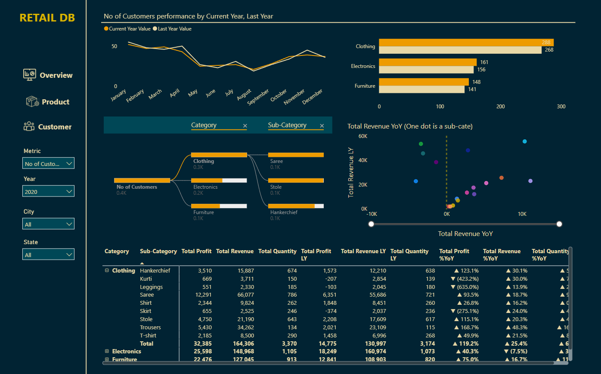

# ⚡ Retail Sales Dashboard

A Power BI dashboard designed to visualize and monitor key sales performance metrics for a retail company. The report helps stakeholders track business activity across stores, products, and customer supporting strategic decision-making in retail operations.

## 📈 Dashboard Preview

🔗 [View the live dashboard](https://app.powerbi.com/view?r=eyJrIjoiNTUzNzA0MzctNDM4MS00ODE2LWFhN2ItNGU3ZDQyMTY5ZTk2IiwidCI6IjJmODVkYzc0LWI2YjQtNDU4NC1iZWVlLWNjZGE3MTQ0NDk3MCIsImMiOjZ9)

## 📊 Key Features

- Total revenue and units sold over time
- Best-selling products and sales by category
- Store performance by region
- Customer demographics and cohort analysis
- Interactive filters for drill-down analysis
- Visual storytelling with retail KPIs

## 🧹 Data Preparation

The report was built upon four relational datasets:

- **Transactions**: Sales transaction logs including quantity, date, and customer/product IDs
- **Products**: Product catalog with name, category, and pricing
- **Customers**: Customer demographics (age, gender, location)
- **Stores**: Store details by region and address

All data modeling and cleaning steps were conducted in Power Query and Power BI, ensuring:

- Proper key relationships between tables
- Standardized formats for numerical and date values
- Accurate DAX measures for business KPIs

## 📁 Tools & Technologies

- **Power BI**: Data modeling, DAX, dashboard design
- **Power Query**: ETL workflows and data shaping
- Relationship diagram optimization
- Business-centric report layout and navigation

## 🧠 Additional Highlights

- Custom slicers and tooltips for deeper interactivity
- Region-based comparisons for store performance
- Use of card visuals and bar/line charts for clarity
- Dashboard theme aligned with retail brand colors
